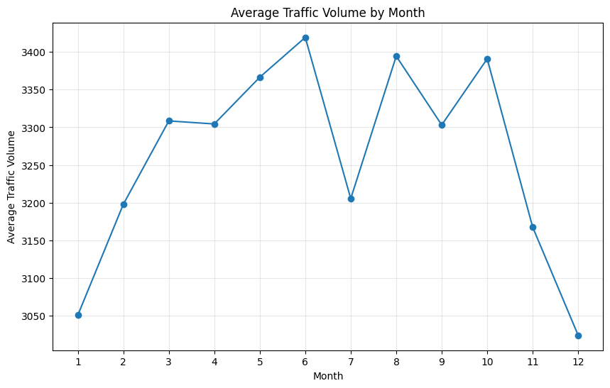
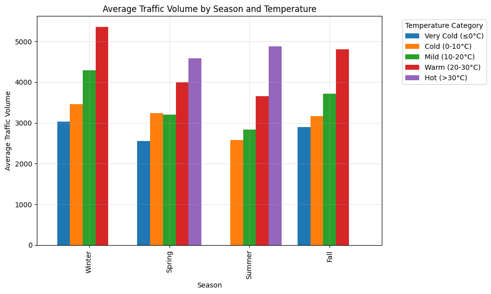
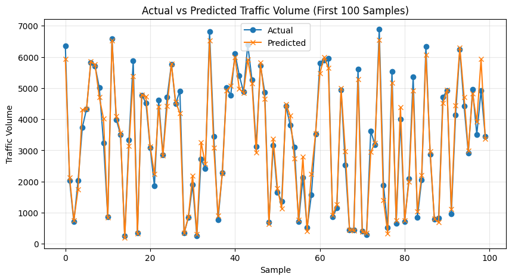

# 🚦 Predicting Traffic Congestion

## 📌 Executive Summary
This project aims to accurately predict hourly traffic volume on interstate highways using a combination of environmental and temporal data. By leveraging **Classical Machine Learning (XGBoost)** and **Deep Learning (LSTM & GRU)**, the project identifies key variables driving traffic congestion, such as temperature, weather conditions, time of day, and seasonality.

## 📊 Dataset Overview
The project utilizes the **Metro Interstate Traffic Volume** dataset, containing chronological traffic volume data along with weather features:
- `Metro_Interstate_Traffic_Volume.csv` - The raw dataset.
- `cleaned_traffic_data.csv` - The preprocessed data used for modeling.

## 🔍 Exploratory Data Analysis (EDA)
Comprehensive EDA was conducted to uncover traffic patterns:
1. **Temporal Patterns:** Identified peak rush hours and differences between weekday and weekend volumes.
2. **Weather Impact:** Analyzed correlation between specific weather conditions (Rain, Snow, Clouds) and congestion levels.
3. **Temperature Trends:** Investigated seasonal shifts and how temperature categories (Cold, Mild, Hot) influence daily commute behavior.

*(Below is an example of the visualizations generated in the notebook)*

### Traffic Volume Trends & EDA

## ⚙️ Feature Engineering
To prepare the data for robust modeling, several transformations were applied:
- **Datetime Extraction:** Parsing `date_time` into `hour`, `dayofweek`, `month`, `year`, and `season`.
- **Categorical Encoding:** One-Hot Encoding applied to `weather_main` and `temp_category`.
- **Handling Missing Values:** Median imputation for continuous variables and mode imputation for categorical ones.
- **Scaling:** Applied `MinMaxScaler` specifically for Deep Learning sequence models.

## 🧠 Modeling Approach

### 1. Classical Machine Learning: XGBoost
XGBoost was chosen for its exceptional performance on tabular data and its ability to capture complex non-linear relationships through gradient boosting.
- **Evaluation:** Evaluated using 5-Fold Cross Validation.
- **Feature Importance:** Analyzed to identify the most significant drivers of traffic.

### Feature Importance (XGBoost)

### 2. Deep Learning: LSTM & GRU
Since traffic data is inherently a time-series problem, Recurrent Neural Networks were implemented to capture the sequential dependencies from past hours.
- **LSTM (Long Short-Term Memory):** 2 hidden layers with a sliding window approach for sequence prediction.
- **GRU (Gated Recurrent Unit):** Implemented for faster convergence while maintaining accuracy.
- **Optimization:** Early stopping and RMSprop/Adam optimizers utilized to prevent overfitting.

### Model Predictions vs Actual

## 📈 Evaluation Metrics
Both approaches were rigorously evaluated using standard regression metrics:
- **MAE (Mean Absolute Error)**
- **RMSE (Root Mean Square Error)**
- **R² Score (Coefficient of Determination)**

*Both XGBoost and Deep Learning models yielded high R² scores (>0.95), proving the robustness of the engineered features and model architectures.*

## 📂 Project Structure
- `traffic_volume_analysis.ipynb`: The main notebook containing all code, EDA, model training, and evaluation.
- `images/`: Directory containing extracted visualization charts from the notebook experiments.
- `PREDICTING TRAFFIC CONGESTION.v2.pptx`: Presentation slides summarizing methodologies and findings.

---
*Developed as part of a Capstone Data Science Project.*
